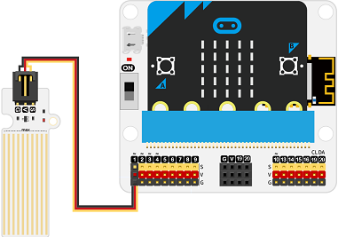

# Water Level Sensor with MakeCode

The following example uses the [ELECFREAKS Octopus Water Level Sensor](https://www.elecfreaks.com/octopus-water-level-sensor.html) displayed below:

Documentation for this sensor can be found [here](https://wiki.elecfreaks.com/en/microbit/sensor/octopus-sensors/sensor/octopus_ef04094).

---

## Step 1: Connect the Water Level Sensor to the Breakout Board

The breakout boards provided for this presentation may differ from the one presented below. The breakout boards from DFRobot have a green pin instead of a yellow pin for the GPIO. Nevertheless, the functionality is the same for this demonstration as the order is still SVG.

Connect the water level sensor to pin 1 on the breakout board. The black pin (GND) should be connected to the black wire.

---

## Step 2: Import the *datalogger* extension

Select the ***Extensions*** in the Blocks Toolbox.

  

Search for the ***datalogger*** extension and select it. 

