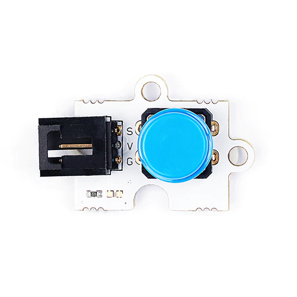
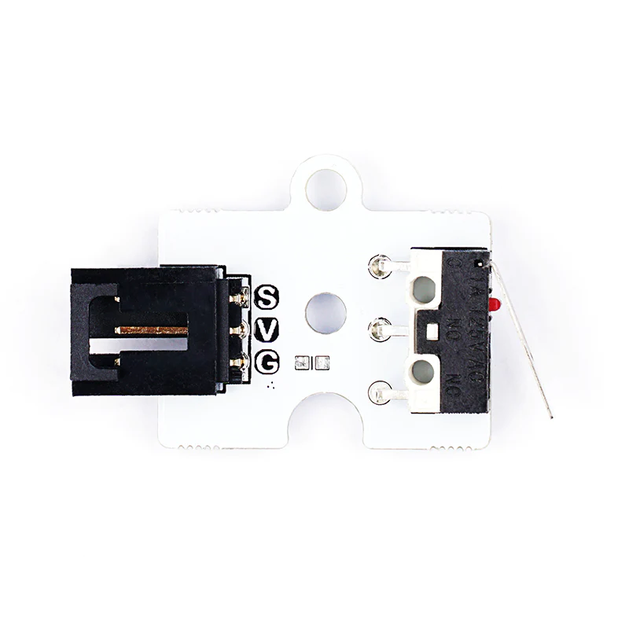
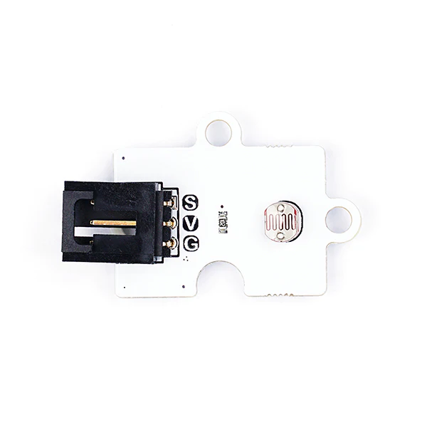

# Octopus Sensor Modules with MakeCode

The following example uses the [ELECFREAKS Octopus Water Level Sensor](https://www.elecfreaks.com/octopus-water-level-sensor.html) displayed below:

Documentation for this sensor can be found [here](https://wiki.elecfreaks.com/en/microbit/sensor/octopus-sensors/sensor/octopus_ef04094).

---
## Example: Octopus Potentiometer
### Step 1: Connect the Potentiometer to the Breakout Board

The breakout boards provided for this presentation may differ from the one presented below. The breakout boards from DFRobot have a green pin instead of a yellow pin for the GPIO. Nevertheless, this demonstration's functionality is the same, as the order is still SVG.

Connect the water level sensor to pin 1 on the breakout board. The black pin (GND) should be connected to the black wire.

---

### Step 2: Import the Extensions

#### Importing the **datalogger** Extension

Select the ***Extensions*** in the Blocks Toolbox.

  

Search for the ***datalogger*** extension and select it. 

The datalogger blocks are now available in the Blocks Toolbox.

#### Importing the Extensions for Octopus Sensor Modules

> [!NOTE]
> THIS EXTENSION IS NOT USED TO READ THE ANALOG VALUE OF THE POTENTIOMETER, BUT IS USED TO READ THE OTHER SENSORS. 

---

### Step 3: Label the Column on the `MY_DATA.HTM` File

Select the `set columns` block.

Place the the `set columns` block in the `on start` block.

Enter text

|                                                              | Octopus Sensor                                       | MakeCode Block                                               |
| ------------------------------------------------------------ | ---------------------------------------------------- | ------------------------------------------------------------ |
|  | BME280 Temperature/Humidity/Pressure/Altitude Sensor |  |
|  | Button                                               |                                                              |
|  | Crash Sensor                                         |                                                              |
|  | DHT11 Temperature and Humidity Sensor                |                                                              |
|  | DS18B20 Waterproof Temperature Sensor                |                                                              |
|  | Noise Sensor                                         |  |
|  | Photocell Light Sensor                               |  |
|  | PIR Motion Sensor                                    |                                                              |
|  | Potentiometer                                        |                                                              |
|  | Soil Moisture Sensor                                 |  |
|  | Ultrasonic Distance Sensor                           |                                                              |
|  | UV Sensor                                            |  |
|  | Water Level Sensor                                   |  |

---

## Data Logging MakeCode Files
### Full Code Files

BME280 Temperature/Humidity/Pressure/Altitude Sensor

[DHT11 Temperature and Humidity Sensor](https://makecode.microbit.org/S03719-79254-31365-14802)

[DS18B20 Waterproof Temperature Sensor](https://makecode.microbit.org/S17353-69686-04118-57184)

[Noise Sensor](https://makecode.microbit.org/S68700-11119-27920-44083)

Photocell Light Sensor

[PIR Motion Sensor](https://makecode.microbit.org/S57511-02520-74396-99456)

[Potentiometer](https://makecode.microbit.org/S77162-35748-31506-14166)

Soil Moisture Sensor

[Ultrasonic Distance Sensor](https://makecode.microbit.org/S88082-50114-95773-88133)

[UV Sensor](https://makecode.microbit.org/S45208-14340-04934-11502)

[Water Level Sensor](https://makecode.microbit.org/S38317-05858-09223-80552)

### 
