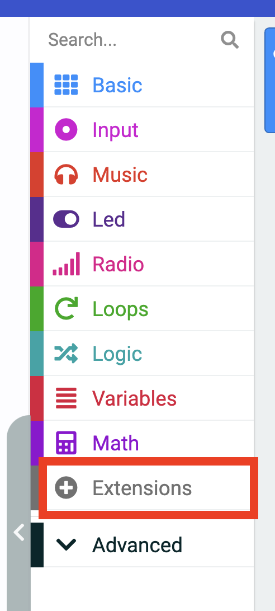

# Octopus Sensor Modules with MakeCode

The example uses the [ELECFREAKS Octopus Noise Sensor](https://shop.elecfreaks.com/products/elecfreaks-octopus-analog-noise-sensor?_pos=1&_sid=3b206475e&_ss=r) displayed below:

---
## Example: Octopus Noise Sensor
### Step 1: Connect the Noise to the Breakout Board

The breakout boards provided for this presentation may differ from the one presented below. The breakout boards from DFRobot have a green pin instead of a yellow pin for the GPIO. Nevertheless, this demonstration's functionality is the same, as the order is still SVG.

Connect the water level sensor to pin 1 on the breakout board. The black pin (GND) should be connected to the black wire.

---

### Step 2: Import the Extensions

#### Importing the **datalogger** Extension

Select the ***Extensions*** in the Blocks Toolbox.

  

Search for the ***datalogger*** extension and select it. 

The datalogger blocks are now available in the Blocks Toolbox.

#### Importing the Extensions for Octopus Sensor Modules

> [!NOTE]
> THIS EXTENSION IS NOT USED TO READ THE ANALOG VALUE OF THE POTENTIOMETER, BUT IS USED TO READ THE OTHER SENSORS. 

The Octopus blocks are now available in the Blocks Toolbox.

---

### Step 3: Mirror Data to Serial

Drag the `mirror data to serial` block from `Data Logger` into the `on start` block:

---

### Step 4: Label the Label the Columns on the `MY_DATA.HTM` File 

 

Select the `set columns` block from `Data Logger`. Drag it under the `mirror data to serial` block:

Name the column.

---

### Step 5: Get a Timed Loop 

Get an `every <500> ms` block from `Loops` (green):

---

### Step 6: Get Conditional Blocks

Get two `if < > then` blocks from `Logic` (teal):

---

### Step 7: Get the Conditions

Get two `block < > is pressed` blocks from `Input` . Place them in the open space of the `if < > then` blocks. Make sure that one is `A` and one is `B`.

---

### Step 8: Add The Data Logging Block

Get a `log data < >` block from `Data Logger` Place it in the `if button <A> is pressed then` block.

Name the column the same name as in **Step 4**:

Drag an Octopus block in as the value:

Add a `delete log` block in the `if button <b> is pressed` block.

**All done**

Here is the full code:

## Other ELECFREAKS Octopus Sensors

Here are the sensors that are available to tinker with in this presentation. The code will be the same as above with a sensor-specific code.  For example:

|                                                              | Octopus Sensor                        | MakeCode Block                                               |
| ------------------------------------------------------------ | ------------------------------------- | ------------------------------------------------------------ |
|  | DHT11 Temperature and Humidity Sensor |  |
|  | DS18B20 Waterproof Temperature Sensor |  |
|  | Noise Sensor                          |  |
|  | Photocell Light Sensor                |  |
|  | PIR Motion Sensor                     |  |
|  | Soil Moisture Sensor                  |  |
|  | Ultrasonic Distance Sensor            |  |
|  | UV Sensor                             |  |
|  | Water Level Sensor                    |  |

---

## Data Logging MakeCode Files
### Full Code Files

[DHT11 Temperature and Humidity Sensor](https://makecode.microbit.org/S03719-79254-31365-14802)

[DS18B20 Waterproof Temperature Sensor](https://makecode.microbit.org/S17353-69686-04118-57184)

[Noise Sensor](https://makecode.microbit.org/S68700-11119-27920-44083)

[Photocell Light Sensor](https://makecode.microbit.org/S89999-13858-88027-85367)

[PIR Motion Sensor](https://makecode.microbit.org/S57511-02520-74396-99456)

[Potentiometer](https://makecode.microbit.org/S77162-35748-31506-14166)

[Soil Moisture Sensor](https://makecode.microbit.org/S36205-15253-87046-65346)

[Ultrasonic Distance Sensor](https://makecode.microbit.org/S88082-50114-95773-88133)

[UV Sensor](https://makecode.microbit.org/S45208-14340-04934-11502)

[Water Level Sensor](https://makecode.microbit.org/S38317-05858-09223-80552)

### 
