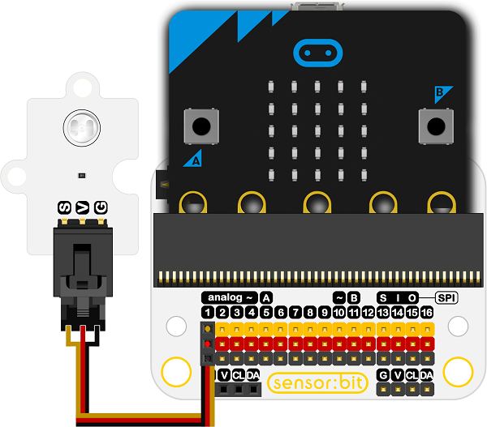
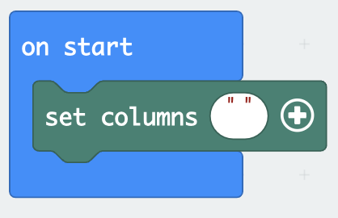
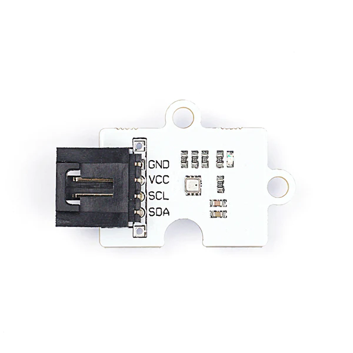
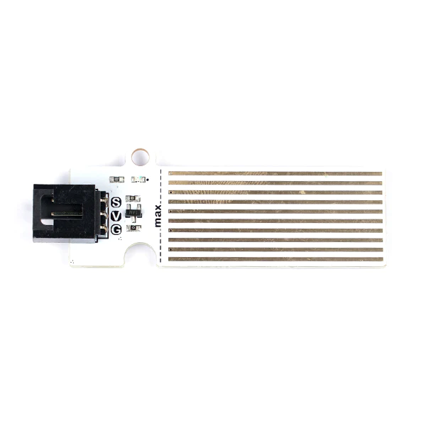

# Octopus Sensor Modules with MakeCode

The following example uses the [ELECFREAKS Octopus Water Level Sensor](https://www.elecfreaks.com/octopus-water-level-sensor.html) displayed below:

Documentation for this sensor can be found [here](https://wiki.elecfreaks.com/en/microbit/sensor/octopus-sensors/sensor/octopus_ef04094).

---
## Example: Octopus Light Sensor
### Step 1: Connect the Water Level Sensor to the Breakout Board

The breakout boards provided for this presentation may differ from the one presented below. The breakout boards from DFRobot have a green pin instead of a yellow pin for the GPIO. Nevertheless, the functionality is the same for this demonstration, as the order is still SVG.

Connect the water level sensor to pin 1 on the breakout board. The black pin (GND) should be connected to the black wire.

---

### Step 2: Import the Extensions

Select the ***Extensions*** in the Blocks Toolbox.

  

Search for the ***datalogger*** extension and select it. 

The datalogger blocks are now avalable in the Blocks Toolbox.

---

### Step 3: Label the Column on the `MY_DATA.HTM` File

Select the `set columns` block.

Place the the `set columns` block in the `on start` block.

Enter text

|                                                              | Octopus Sensor         | MakeCode Block                                               |
| ------------------------------------------------------------ | ---------------------- | ------------------------------------------------------------ |
|  | BME280 Pressure Sensor |  |
|  | Light Sensor           |  |
|  | Noise Sensor           |  |
|  | Soil Moisture Sensor   |  |
|  | UV Sensor              |  |
|  | Water Level Sensor     |  |

