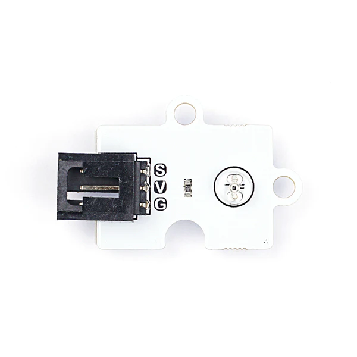
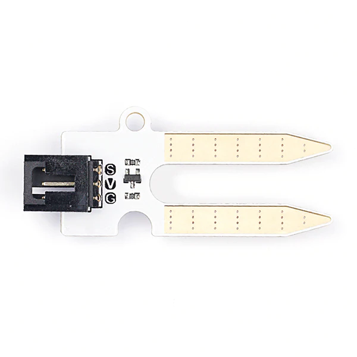

# Octopus Sensor Modules with MicroPython

The following example uses the [ELECFREAKS Octopus Light Sensor](https://www.elecfreaks.com/octopus-water-level-sensor.html) displayed below:



## Example: Octopus Light Sensor

### Step 1: Connect the Sensor to the Breakout Board

The breakout boards provided for this presentation may differ from the one presented below. The breakout boards from DFRobot have a green pin instead of a yellow pin for the GPIO. Nevertheless, the functionality is the same for this demonstration, as the order is still SVG.

Connect the sensor to pin 1 on the breakout board. The black pin (GND) should be connected to the black wire.


---

### Step 2: Import the Modules


```python
from micro:bit import *
import log
from octopus import WATER_LEVEL
```


---

### Step 3: Label the Column on the `MY_DATA.HTM` File

```python
log.set_labels('light')
```


```python
while True:
    log.add({'light': WATER_LEVEL(pin1).get_water_level()})
    sleep(100)
```


```python
from microbit import *
import log
from octopus import WATER_LEVEL

log.set_labels('light')

while True:
    log.add({'light': WATER_LEVEL(pin1).get_water_level()})
    sleep(100)
```


|                                                              | Octopus Sensor       | `from octopus import <enter here>` |                                                              |
| ------------------------------------------------------------ | -------------------- | ---------------------------------- | ------------------------------------------------------------ |
|  | BME 280              | `BME20`                            | `BME280(pin1).get_temperature()`<br />`BME280(pin1).get_humidity()`<br />`BME280(pin1).get_altitude()`<br />`BME280(pin1).get_pressure()` |
|  | Light Sensor         | `LIGHT`                            | `LIGHT(pin1).get_light()`                                    |
|  | Noise Sensor         | `NOISE`                            | `NOISE(pin1).get_noise()`                                    |
|  | Soil Moisture Sensor | `SOIL_MOISTURE`                    | `SOIL_MOISTURE(pin1).get_soil_moisture()`                    |
|  | UV Sensor            | `UV`                               | `UV(pin1).get_uv_index()`                                    |
|  | Water Level Sensor   | `WATER_LEVEL`                      | `WATER_LEVEL(pin1).get_water_level()`                        |

