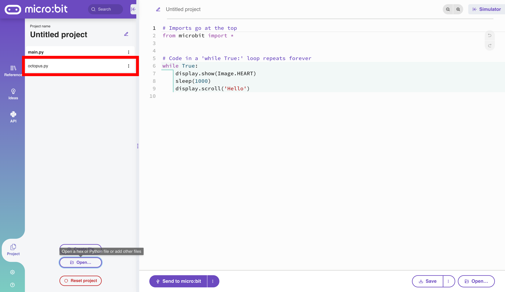

# Octopus Sensor Modules with MicroPython

The following example uses the [ELECFREAKS Octopus Photocell Sensor](https://www.elecfreaks.com/octopus-water-level-sensor.html) displayed below:


## Example: Octopus Light Sensor

### Step 1: Connect the Sensor to the Breakout Board

The breakout boards provided for this presentation may differ from the one presented below. The breakout boards from DFRobot have a green pin instead of a yellow pin for the GPIO. Nevertheless, this demonstration's functionality is the same, as the order is still SVG.

Connect the sensor to pin1 on the breakout board. The black pin (GND) should be connected to the black wire.


---

### Step 2: Uploading External Modules

The `log` module is a built-in module. The `octopus` module is an external file that must be uploaded into the [mico:bit Python Editor](https://python.microbit.org/v/3).

#### Downloading `octopus.py`

First, download the octopus module (`octopus.py`) in the GitHub repository [here](https://github.com/simonhasan/microbit-data-logging-2023-12-03/blob/main/code-files/octopus.py). This is a collection of several official ELECFREAKS modules combined in one file for convenience.

Click on the  icon to download the file.

#### Uploading `octopus.py` into the micro:bit Python Editor.

Click on the **Projects** icon.


Click on the **Open** button.


> [!NOTE]
>  **Replace main code with ...** is the default. This will replace the code file flashed to the micro:bit.


Change the way the file is imported with the file settings icon .

                                                                            

Change the option from **Replace main code with octopus.py** to **Add file octopus.py**.


The change is reflected in the dialog box.


Press the **Confirm** button.


The file `octopus.py` is now available as a Python module that can be imported.



The file now works with the micro:bit Python Editor code completion feature.


---

### Step 3: Import the Modules

Import the necessary modules with `import log` and `from octopus import LIGHT` as demonstrated below:

```python
from micro:bit import *
import log
from octopus import LIGHT
```

---

### Step 4: Delete the Previous Log

```python 
# Delete MY_DATA.HTM if present
log.delete()
```

---

### Step 5: Enable `mirroring` in Serial

This is not compulsory, but seeing the data being recorded shows that the code is working.

```python
# Enable mirroring in serial
log.set_mirroring(True)
```

---

### Step 6: Label the Column on the `MY_DATA.HTM` File

Set the name of the row labels on the log file.

```python
# Label the light column on the MY_DATA.HTM file
log.set_labels('light')
```

---

### Step 7: Create an Instance of the Light Object

This is just good practice.

```python
# Create an instance of the Light class
light = Light(pin1)
```


---

### Step 8: Log the Data

Log the data every millisecond `sleep(1)` in a `while` loop with the `log.add()`  method. 

```python
# Code in a 'while True:' loop repeats forever
while True:
    # Add a row to MY_DATA.HTM 
    log.add({
        'light': light.get_light()
    })
    # Repeat every 10 milliseconds
    sleep(10)
```

Here is the complete code for the Octopus Light Sensor.

```python
# Imports go at the top
from microbit import *
import log
from octopus import Light

# Delete MY_DATA.HTM if present
log.delete()

# Enable mirroring in serial
log.set_mirroring(True)

# Label the light column on the MY_DATA.HTM file
log.set_labels('light')

# Create an instance of the Light class
light = Light(pin1)

# Code in a 'while True:' loop repeats forever
while True:
    # Add a row to MY_DATA.HTM 
    log.add({
        'light': light.get_light()
    })
    # Repeat every 10 milliseconds
    sleep(10)

```
> [!NOTE]
>
> This code has no interrupts or exception handling. These topics are beyond the scope of the presentation. This code logs data until the memory is full and returns the following error:

```
Traceback (most recent call last):
  File "main.py", line 9, in <module>
OSError: [Errno 28] ENOSPC
```

The code runs for approximately 43 seconds and logs over 7500 logs before it fills the memory on the micro:bit.

---

## Other ELECFREAKS Octopus Sensors

Here are the sensors that are available to tinker with in this presentation. The code will be the same as above with a sensor-specific code. For example:

If the Octopus Water Level sensor is chosen use `from octopus import WATER_LEVEL` instead of `from octopus import LIGHT`. The method will be `WATER_LEVEL(pin1).get_water_level` instead of `LIGHT(pin1).get_light()`

|                                                              | Octopus Sensor           | `from octopus import ...` | Method for the Sensor                                        |
| ------------------------------------------------------------ | ------------------------ | ------------------------- | ------------------------------------------------------------ |
|  | BME280 Pressure Sensor   | `BME20`                   | `BME280().get_temperature()`<br />`BME280().get_humidity()`<br />`BME280().get_altitude()`<br />`BME280().get_pressure()`<br />**NOTE: This does not require a pin number.** |
|  | Button                   | `Button`                  | `button = Button(pin1)`<br /><br />`button.get_presses()`    |
|  | Crash Sensor             | `Crash`                   | `crash = Crash(pin1)`<br /><br />`crash.get_presses()`       |
|  | Noise Sensor             | `Noise`                   | `noise = Noise(pin1)`<br /><br />`noise.get_noise()`         |
|  | Potentiometer            | `Potentiometer`           | `p = Potentiometer(pin1)`<br /><br />`p.get_analog()`        |
|  | PIR Motion Sensor        | PIR                       | `pir = PIR(pin1)`<br /><br />`pir.get_motion()`              |
|  | Photocell Sensor         | `Light`                   | `light = Light(pin1)`<br /><br />`light.get_light()`         |
|  | Soil Moisture Sensor     | `SoilMoisture`            | `sm = SoilMoisture(pin1)`<br /><br />`sm.get_soil_moisture()` |
|  | TMP36 Temperature Sensor | `TMP36`                   | `temp = TMP36(pin1)`<br /><br />`temp.get_temperature()`     |
|  | UV Sensor                | `UV`                      | `uv = UV(pin1)`<br /><br />`uv.get_uv()`                     |
|  | Water Level Sensor       | `WaterLevel`              | `wl = WaterLevel(pin1)`<br /><br />`wl.get_water_level()`    |

