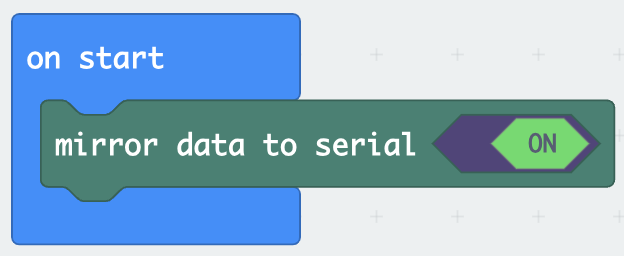
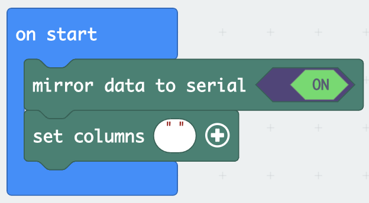

# On-Board Sensor Data Logging with MakeCode

This example uses the onboard sensors displayed below on the micro:bit:

## Example: Accelerometer

### Step 1: Import the datalogger Extension

Select the ***Extensions*** in the Blocks Toolbox.

  

Search for the ***datalogger*** extension and select it. 

The datalogger blocks are now available in the Blocks Toolbox.

### Step 2: Mirror Data to Serial

Drag the `mirror data to serial` block into the `on start` block:

---

### Step 4: Label the Label the Columns on the `MY_DATA.HTM` File 

 

Select the `set columns` block. Drag it under the `mirror data to serial` block:

